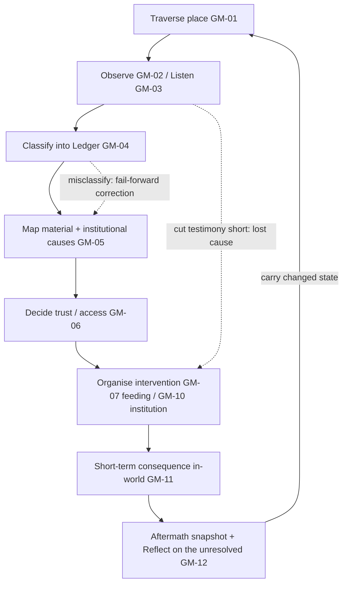

# 03 — Core Gameplay Loop

This document refines the owner's proposed 9-step loop into three nested loops
(minute / scene / chapter), specifies progression, fail-forward, saves, and — most
importantly — **how the game avoids repetitive dialogue and resource management**.

## The refined loop (owner's 9 steps, mapped)

| Owner step | Game verb | Mechanic | Repo anchor |
|---|---|---|---|
| 1. Explore | Traverse a bounded place | `GM-01` | `SEQ-04` locations: teacher's dwelling, Aadhirai's threshold, Ulaga Aravi, prison |
| 2. Observe | Look at labour/food/architecture/barriers | `GM-02` | `04H` §6; storyboard "labour visible behind wealth" |
| 3. Listen | Let accounts finish | `GM-03` | `FU-017`/`FU-018` |
| 4. Classify | Ledger of Knowing (7 types) | `GM-04` | `05B`; `PHL-02` |
| 5. Identify causes | Causal map (material + institutional) | `GM-05` | 10A "material and institutional causes" |
| 6. Decide whom to trust | Trust & Access model | `GM-06` | `SEQ-06` witness safety; `05` |
| 7. Organise intervention | Feeding logistics / institutional act | `GM-07`,`GM-10` | `FU-022`,`FU-024` |
| 8. Observe consequences | Consequence + aftermath state | `GM-11` | 10A "what happens after Manimekalai leaves" |
| 9. Reflect | Journal of the unresolved | `GM-12` | 10A ending "commitment, not perfection" |

Mechanics are registered in [`08-mechanics-register.csv`](08-mechanics-register.csv).

## Minute-to-minute loop (~30–90 s)

> **Move → notice a detail → choose to observe or listen → capture it into the
> Ledger → the place visibly reacts.**

- The player walks a small space (`GM-01`). Interactable people/objects/barriers are
  *diegetic* — a stalled water pot, a person who cannot stand in a queue, a bolted
  door — not floating markers (mitigates `GRT-05`).
- **Observe** yields a *direct observation* card; **Listen** yields a *testimony*
  card that must be allowed to finish (Pillar 2). The player then **classifies** it
  (`GM-04`).
- Immediate feedback is **in the world**, not in numbers: a crowd shifts, a person
  relaxes, a guard's posture changes. (Feedback design detail in `04`.)

This loop is the "conversation and exploration" heartbeat. It has no combat, no
timers-by-default, no resource bars on screen.

## Scene-to-scene loop (~5–12 min = one feature unit)

> **Enter a place with an unclear problem → build understanding (observe/listen/
> classify) → find the binding constraint(s) → organise a compassionate response →
> watch short-term consequence → carry a changed state forward.**

- Each playable scene corresponds to one `FU-*`/`BR-*` and introduces or tests
  **one system** (see per-scene "system introduced" column in `07`). Example: `FU-022`
  *introduces* feeding-logistics; `FU-024` *tests* it under institutional power.
- A scene ends by **handing a changed state to the next** — mirroring the
  storyboard's ENTRY→DECISION→CONSEQUENCE shot grammar (`SB-*`), which the game
  reuses as scene structure, not as cutscene.

## Chapter-level loop (~45–75 min = one `SEQ-*`)

> **Arrive as an outsider → learn the neighbourhood's hunger/justice system →
> intervene at increasing scale → face a limit the bowl cannot solve → leave, and
> see the aftermath in an epilogue card.**

- Each chapter escalates the *scale of the same ethic*: household (Aadhirai) →
  public square (Ulaga Aravi) → institution (prison). This is the epic's own
  movement (10A Act II), not invented escalation.
- A chapter closes on **reflection** (`GM-12`) and an **aftermath snapshot**
  (`GM-11`) that persists into later chapters and the final epilogue (`05`).

## Progression (what actually grows)

The player does **not** gain combat power, gear, or a morality rank. They gain:

1. **Method** — new Ledger categories and reasoning tools unlock as the story earns
   them (e.g. *public proof* becomes usable only after Sequence 04's testimonies;
   *inference-checking* formalises in Sequences 09–10). Progression = epistemic
   maturity, mirroring Manimekalai's arc.
2. **Relationships** — Trust & Access with named people/institutions (`GM-06`),
   which change what testimony is offered and what interventions are permitted.
3. **Standing practices** — a reform you established (e.g. an open records table)
   persists as world-state and can later be *reversed* by others (`SEQ-05`/`06`),
   teaching sustainability (`RISK-013`).

No number goes "up and to the right" as a score. Progress is legible through the
*world* and the *journal*, not a stat screen (Pillar 3/4 acceptance tests).

## Fail-forward design (no game-over)

There is **no death screen and no combat failure**. Consistent with nonviolence and
with the epic's insistence that mistaken certainty has *consequences, not resets*:

- **Misclassify evidence** → you act on an assumption; the outcome is worse and the
  game *shows you the correction* (10A: "make at least one incomplete inference and
  accept correction"). You continue with the corrected understanding.
- **Cut a testimony short** → you miss a cause; the intervention partly fails; the
  witness may trust you less. You continue; you can sometimes re-earn the account.
- **Feed without addressing the binding constraint** → visible unmet need remains;
  the scene doesn't "clear" but does not restart; you iterate the arrangement.
- **Canonical tragedies are not failures to be prevented** (`05`). When Udayakumaran
  dies (`SEQ-05`), that is *authored*, not a loss the player mismanaged. The game
  makes the fixed/variable boundary explicit so players never feel they "should have
  saved" a canonically-doomed character.

Fail-forward keeps tension (Pillar 5) without punishment loops that would push
players toward optimisation over understanding.

## Save / checkpoint approach

- **[DESIGN]** **Autosave at every scene boundary** (`FU-*` handoff) plus a single
  manual "rest" save — matches a reflective, non-twitch game and mobile/web
  interruption patterns (`12`).
- **No save-scumming incentive:** because outcomes are fail-forward (not win/lose),
  reloading to "get the good ending" is neither necessary nor rewarded. A late-game
  **"what remained unresolved"** recap (`GM-12`) explicitly values honest play over
  optimised play.
- **Bilingual + accessibility state** (language, text size, reduced motion, dialogue
  history) persists in the save and across sessions (`12`).
- **Technical:** browser build uses versioned local persistence with export/import
  (see `10`), so a playtester can hand a save back for debugging.

## How the game avoids repetitive dialogue

1. **Testimony is consequential, not collectible.** Because letting an account
   finish *changes what you can do* (Pillar 2), dialogue is a lever, not filler.
2. **No exhaustive dialogue trees.** Conversations are short, purposeful, and
   *close*; you cannot re-ask an NPC the same wheel of questions. Re-approaching a
   character yields new lines only when world-state changed.
3. **Diegetic exposition.** Much "information" is *observed* (`GM-02`) from labour,
   architecture and barriers, not narrated — cutting talky redundancy.
4. **One idea per unit.** Each `FU-*` carries one function (10B consolidation); the
   game does not restate it in dialogue after the player has *done* it.
5. **Dialogue history + skip-read** (`12`) so re-encounters never force re-reading.

## How the game avoids repetitive resource management

1. **Diegetic, spatial, low-cardinality.** The feeding system exposes ~3–5
   *placeable* elements per scenario (a route, a second line, a water source, a
   serving hand, an animal edge), arranged **in the scene**, not in a spreadsheet
   (`04`; `GRT-05`). No inventory economy, no crafting, no currency.
2. **Constraints change per place.** Aadhirai's threshold, a crowded square and a
   prison expose *different* binding constraints, so the "manage" step never repeats
   the same optimisation.
3. **Solutions are one-shot state changes, not upkeep.** You *establish* a water
   route; you do not micromanage a depleting water bar every few seconds.
4. **The bowl is not a resource to hoard.** Food is infinite; the interesting
   scarcity is human and institutional. There is nothing to grind.
5. **Difficulty of the *reasoning/logistics* layer is adjustable** (`12`) for players
   who want the story with lighter systems — without removing the ethical point.

## Loop diagram

